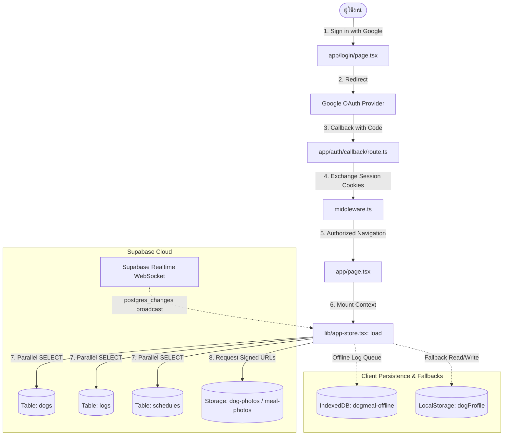

# SYSTEM HANDOFF: DogMeal (Ajo Eating)

> **เอกสารส่งมอบเชิงวิศวกรรม (Engineering Handoff Document)**  
> สร้างขึ้นจากการวิเคราะห์ซอร์สโค้ดและคอนฟิกทั้งหมดในโปรเจกต์แบบบรรทัดต่อบรรทัด โดยไม่มีการคาดเดา สำหรับวิศวกรภายนอกที่ต้องการวิเคราะห์และแก้ปัญหาความไม่เสถียรของระบบ

---

## 1. ภาพรวมระบบ (System Overview)

- **หน้าที่ของระบบ**: เว็บแอปพลิเคชันสำหรับสมาชิกในครอบครัวร่วมกันบันทึกและติดตามการกินอาหารของสุนัขในบ้าน (มื้อเช้า, เที่ยง, เย็น, มื้อพิเศษ) สถานะการกิน (กินหมด / กินบางส่วน / ไม่กิน), ชั่งน้ำหนักอาหาร, ถ่ายรูปก่อน-หลังกิน, คำนวณอายุและสถิติการกินย้อนหลัง
- **กลุ่มผู้ใช้งาน**: สมาชิกในบ้านหลายคน โดยทุกคนที่ล็อกอินผ่าน Google Account ต้องสามารถมองเห็นและร่วมกันอัปเดตข้อมูลสุนัข บันทึก และรูปภาพชุดเดียวกันแบบ Realtime
- **สภาพแวดล้อมที่รัน (Runtime Environment)**:
  - **Hosting**: Vercel Serverless Platform (ดูจาก [`next.config.ts:8-16`](file:///c:/Users/Gladeyejtp/OneDrive/เอกสาร/ChatGPT/Ajo%20eating/next.config.ts#L8-L16) และ [`vercel.json:1-3`](file:///c:/Users/Gladeyejtp/OneDrive/เอกสาร/ChatGPT/Ajo%20eating/vercel.json#L1-L3))
  - **Database & Storage & Auth**: Supabase Cloud Project Hosted (`https://lwwyhkpcltmkmwcmlkef.supabase.co` อ้างอิงจาก [`.env.local:1`](file:///c:/Users/Gladeyejtp/OneDrive/เอกสาร/ChatGPT/Ajo%20eating/.env.local#L1))
  - **Local Development**: Node.js บน Windows (Next.js Dev Server `npm run dev`)

---

## 2. Tech Stack & เวอร์ชันจริง (Exact Stack & Versions)

อ้างอิงจาก [`package.json:11-42`](file:///c:/Users/Gladeyejtp/OneDrive/เอกสาร/ChatGPT/Ajo%20eating/package.json#L11-L42):

```json
{
  "dependencies": {
    "@base-ui/react": "^1.8.0",
    "@sentry/nextjs": "^10.75.0",
    "@supabase/ssr": "^0.7.0",
    "@supabase/supabase-js": "^2.49.1",
    "@vercel/analytics": "^2.0.1",
    "class-variance-authority": "^0.7.1",
    "clsx": "^2.1.1",
    "cn": "^0.3.0",
    "date-fns": "^4.4.0",
    "lucide-react": "^1.47.0",
    "next": "^15.2.0",
    "next-themes": "^0.4.6",
    "react": "^19.0.0",
    "react-day-picker": "^10.0.1",
    "react-dom": "^19.0.0",
    "sonner": "^2.0.8",
    "tailwind-merge": "^3.7.0",
    "tw-animate-css": "^1.4.0"
  },
  "devDependencies": {
    "@eslint/eslintrc": "^3.3.0",
    "@tailwindcss/postcss": "^4.0.0",
    "@types/node": "^22.13.0",
    "@types/react": "^19.0.0",
    "@types/react-dom": "^19.0.0",
    "eslint": "^9.21.0",
    "eslint-config-next": "^15.2.0",
    "tailwindcss": "^4.0.0",
    "typescript": "^5.8.0"
  }
}
```

- **Framework**: Next.js 15.2.0 (App Router), React 19.0.0, React DOM 19.0.0
- **Database/Backend-as-a-Service**: Supabase (PostgreSQL 15+, PostgREST, GoTrue Auth, Realtime WebSocket, S3 Storage API)
- **Styling**: Tailwind CSS v4.0.0, tw-animate-css 1.4.0
- **Monitoring**: Sentry Next.js SDK 10.75.0, Vercel Analytics 2.0.1

---

## 3. โครงสร้างโฟลเดอร์ (Directory Tree)

```text
c:\Users\Gladeyejtp\OneDrive\เอกสาร\ChatGPT\Ajo eating\
├── app/                                 # Next.js App Router
│   ├── auth/callback/route.ts           # OAuth code exchange route handler
│   ├── history/page.tsx                 # หน้ารายการประวัติมื้ออาหารย้อนหลัง
│   ├── log/page.tsx                     # หน้าบันทึกมื้ออาหาร (Form)
│   ├── login/page.tsx                   # หน้าเข้าสู่ระบบ (Google OAuth)
│   ├── settings/page.tsx                # หน้าตั้งค่าโปรไฟล์หมา, เวลา, diagnostics
│   ├── stats/page.tsx                   # หน้าสถิติ, streak, วิเคราะห์พฤติกรรม
│   ├── error.tsx                        # Client root error boundary
│   ├── global-error.tsx                 # Global root layout error boundary
│   ├── layout.tsx                       # Root Layout (Providers, Theme, PWA)
│   └── page.tsx                         # หน้าแรก (มื้อวันนี้ Today View)
├── components/                          # React UI Components
│   ├── ui/                              # Atomic primitives (button, dialog, card, etc.)
│   ├── app-shell.tsx                    # Layout shell wrapper with bottom nav
│   ├── bottom-nav.tsx                   # แถบนำทางด้านล่าง 4 เมนู
│   ├── dog-header.tsx                   # การ์ดแสดงโปรไฟล์และสถานะล่าสุดของสุนัข
│   ├── lazy-image.tsx                   # ภาพโหลดแบบขี้เกียจ + Shimmer skeleton
│   ├── meal-card.tsx                    # การ์ดแสดงสถานะของแต่ละมื้อในหน้าวันนี้
│   ├── meal-log-form.tsx                # ฟอร์มบันทึกมื้ออาหาร
│   ├── notification-center.tsx          # Popover แจ้งเตือนมื้ออาหารที่พลาด
│   ├── offline-banner.tsx               # แถบแจ้งเตือนเมื่ออุปกรณ์ออฟไลน์
│   ├── photo-picker.tsx                 # ปุ่มเลือกรูปภาพและ Canvas WebP compress
│   ├── pwa-install-prompt.tsx           # ป๊อปอัปแนะนำติดตั้ง PWA บน Android/iOS
│   └── pwa-provider.tsx                 # ตัวลงทะเบียน Service Worker
├── lib/                                 # Business Logic, State & Utilities
│   ├── supabase/
│   │   ├── client.ts                    # Browser Supabase client (createBrowserClient)
│   │   └── server.ts                    # Server Supabase client (createServerClient)
│   ├── app-store.tsx                    # Central React Context Store & Sync Controller
│   ├── image-utils.ts                   # Client-side Canvas WebP compression & Transform URLs
│   ├── meal-utils.ts                    # คำนวณช่วงเวลามื้ออาหาร, เขตเวลา Asia/Bangkok
│   ├── offline-queue.ts                 # IndexedDB queue สำหรับ sync ออฟไลน์
│   ├── sentry-reporter.ts               # ตัวดักจับและส่ง exception ไป Sentry
│   ├── types.ts                         # Data types & Interfaces
│   └── utils.ts                         # Helper functions (clsx, twMerge)
├── public/                              # Static Assets & PWA
│   ├── manifest.webmanifest             # PWA Web App Manifest
│   ├── sw.js                            # Service Worker (stale-while-revalidate)
│   └── icons/                           # ไอคอน PWA 192x192, 512x512
├── scripts/
│   └── migrate-photos-to-storage.mjs    # สคริปต์ Node.js สำหรับย้าย base64 สู่ Storage
├── supabase/
│   └── migrations/                      # ไฟล์ SQL Migrations เรียงตามเวลา
│       ├── 20260920000000_initial_schema.sql
│       ├── 20260920000001_member_management.sql
│       ├── 20260921000002_member_roles.sql
│       ├── 20260921000003_create_dog_rpc.sql
│       ├── 20260921000004_storage_and_notifications_cron.sql
│       ├── 20260921000005_role_management_and_invites.sql
│       ├── 20260921000006_shared_access_all_users.sql
│       └── 20260921000007_cleanup_and_fix_shared_access_rls.sql
├── middleware.ts                        # Next.js Edge Auth Cookie Gatekeeper
└── next.config.ts                       # Next.js & Sentry Config
```

---

## 4. Entry Points ทั้งหมด (All Entry Points)

1. **Client Web App Bootstrap**:
   - [`app/layout.tsx:49-68`](file:///c:/Users/Gladeyejtp/OneDrive/เอกสาร/ChatGPT/Ajo%20eating/app/layout.tsx#L49-L68): เมานต์ `<ThemeProvider>`, `<AppStoreProvider>`, `<AppShell>`, `<Toaster>`, และ `<PwaProvider>`
2. **Next.js Edge Middleware**:
   - [`middleware.ts:4-67`](file:///c:/Users/Gladeyejtp/OneDrive/เอกสาร/ChatGPT/Ajo%20eating/middleware.ts#L4-L67): ตรวจสอบ Session Cookie ทุก Request ที่ไม่ใช่ static asset / auth route หากไม่มี Session จะบังคับ Redirect ไป `/login`
3. **HTTP API Route (OAuth Callback)**:
   - [`app/auth/callback/route.ts:5-66`](file:///c:/Users/Gladeyejtp/OneDrive/เอกสาร/ChatGPT/Ajo%20eating/app/auth/callback/route.ts#L5-L66): รับ `GET ?code=xxx` จาก Google OAuth แล้วเรียก `supabase.auth.exchangeCodeForSession(code)` เพื่อสร้าง Auth Cookie
4. **Realtime WebSocket Event Listener**:
   - [`lib/app-store.tsx:361-368`](file:///c:/Users/Gladeyejtp/OneDrive/เอกสาร/ChatGPT/Ajo%20eating/lib/app-store.tsx#L361-L368): สร้าง Channel `dogmeal-ui` ฟังการเปลี่ยนแปลง `postgres_changes` ทุก event (`*`) ในตาราง `logs`, `dogs`, `schedules`, และ `notifications`
5. **Browser Lifecycle & Network Listeners**:
   - [`lib/app-store.tsx:344-358`](file:///c:/Users/Gladeyejtp/OneDrive/เอกสาร/ChatGPT/Ajo%20eating/lib/app-store.tsx#L344-L358): ฟังอีเวนต์ `online`, `offline`, `dog-profile-changed`, และ `pageshow` (Safari/Chrome back-forward cache)
   - [`lib/app-store.tsx:323-330`](file:///c:/Users/Gladeyejtp/OneDrive/เอกสาร/ChatGPT/Ajo%20eating/lib/app-store.tsx#L323-L330): ฟัง Supabase `onAuthStateChange` (`INITIAL_SESSION`, `SIGNED_IN`, `TOKEN_REFRESHED`, `SIGNED_OUT`)
6. **Service Worker (PWA)**:
   - [`public/sw.js:15-83`](file:///c:/Users/Gladeyejtp/OneDrive/เอกสาร/ChatGPT/Ajo%20eating/public/sw.js#L15-L83): ดักจับ Fetch requests ทำ Stale-while-revalidate สำหรับหน้าเว็บและ assets
7. **Database Scheduler (Cron Job)**:
   - [`supabase/migrations/20260921000004_storage_and_notifications_cron.sql:172-187`](file:///c:/Users/Gladeyejtp/OneDrive/เอกสาร/ChatGPT/Ajo%20eating/supabase/migrations/20260921000004_storage_and_notifications_cron.sql#L172-L187): `pg_cron` รันทุก 15 นาที (`*/15 * * * *`) เรียกฟังก์ชัน `public.check_missed_meals()` ใน Postgres

---

## 5. Data Flow (การไหลของข้อมูล)

### ลำดับขั้นตอน (Data Lifecycle):
1. ผู้ใช้เข้าสู่ระบบด้วย Google ผ่าน [`app/login/page.tsx`](file:///c:/Users/Gladeyejtp/OneDrive/เอกสาร/ChatGPT/Ajo%20eating/app/login/page.tsx) → ส่งไป Google OAuth → กลับมาที่ [`app/auth/callback/route.ts`](file:///c:/Users/Gladeyejtp/OneDrive/เอกสาร/ChatGPT/Ajo%20eating/app/auth/callback/route.ts) เพื่อเซ็ต Session Cookie
2. เข้าหน้าหลัก [`app/page.tsx`](file:///c:/Users/Gladeyejtp/OneDrive/เอกสาร/ChatGPT/Ajo%20eating/app/page.tsx) → [`lib/app-store.tsx`](file:///c:/Users/Gladeyejtp/OneDrive/เอกสาร/ChatGPT/Ajo%20eating/lib/app-store.tsx) ถูกเมานต์
3. `onAuthStateChange` ปล่อย `INITIAL_SESSION` → เรียกฟังก์ชัน `load()` ([`lib/app-store.tsx:148-310`](file:///c:/Users/Gladeyejtp/OneDrive/เอกสาร/ChatGPT/Ajo%20eating/lib/app-store.tsx#L148-L310))
4. `load()` ส่งคำสั่ง `Promise.all` ขนานกัน 4 เส้นไปยัง Supabase PostgREST:
   - `SELECT id,name,photo,owner_id,created_at FROM dogs`
   - `SELECT id,dog_id,label,time FROM schedules`
   - `SELECT id,dog_id,schedule_id,at,status,amount_g,food,note,photo,by,created_at FROM logs ORDER BY at DESC`
   - `SELECT id,dog_id,user_id,meal_key,schedule_id,message,is_read,created_at FROM notifications ORDER BY created_at DESC LIMIT 50`
5. นำ Storage path ของรูปภาพไปขอ Signed URLs ผ่าน `getCachedSignedUrl` ([`lib/app-store.tsx:52-102`](file:///c:/Users/Gladeyejtp/OneDrive/เอกสาร/ChatGPT/Ajo%20eating/lib/app-store.tsx#L52-L102))
6. ข้อมูลถูกเซ็ตลงใน React State (`dogs`, `schedules`, `logs`, `notifications`)
7. เมื่อมีการบันทึกมื้ออาหารใหม่ที่ [`app/log/page.tsx`](file:///c:/Users/Gladeyejtp/OneDrive/เอกสาร/ChatGPT/Ajo%20eating/app/log/page.tsx):
   - ถ้า Online: อัปโหลดรูปขึ้น Storage Bucket `meal-photos` → Insert แถวลงตาราง `logs` ใน Supabase → Realtime WebSocket ยิงสะท้อนกลับมา trigger `debouncedLoad()` ทุกเครื่องที่เปิดค้างไว้
   - ถ้า Offline: บันทึกลง IndexedDB ผ่าน [`lib/offline-queue.ts`](file:///c:/Users/Gladeyejtp/OneDrive/เอกสาร/ChatGPT/Ajo%20eating/lib/offline-queue.ts) → รอสัญญาณ `online` เพื่อ flush ขึ้น Supabase

### Mermaid Diagram:



---

## 6. Data Layer & Schemas (ฐานข้อมูลและการจัดการสิทธิ์)

### ตารางหลักและความสัมพันธ์ (Relational Schema):
อ้างอิงจาก [`supabase/migrations/20260920000000_initial_schema.sql:13-50`](file:///c:/Users/Gladeyejtp/OneDrive/เอกสาร/ChatGPT/Ajo%20eating/supabase/migrations/20260920000000_initial_schema.sql#L13-L50):

1. **`public.dogs`**:
   - `id`: `uuid primary key default gen_random_uuid()`
   - `name`: `text not null`
   - `photo`: `text` (เก็บ storage path หรือ fallback base64 URL)
   - `owner_id`: `uuid not null references auth.users(id)`
   - `created_at`: `timestamptz not null default now()`
   - *เพิ่มในภายหลัง*: `breed text`, `birthdate text` (จาก [`20260921000007_cleanup_and_fix_shared_access_rls.sql:160-161`](file:///c:/Users/Gladeyejtp/OneDrive/เอกสาร/ChatGPT/Ajo%20eating/supabase/migrations/20260921000007_cleanup_and_fix_shared_access_rls.sql#L160-L161))
2. **`public.schedules`**:
   - `id`: `uuid primary key default gen_random_uuid()`
   - `dog_id`: `uuid not null references public.dogs(id) on delete cascade`
   - `label`: `text not null`
   - `time`: `time not null`
   - `created_at`: `timestamptz not null default now()`
3. **`public.logs`**:
   - `id`: `uuid primary key default gen_random_uuid()`
   - `dog_id`: `uuid not null references public.dogs(id) on delete cascade`
   - `schedule_id`: `uuid references public.schedules(id) on delete set null`
   - `at`: `timestamptz not null default now()`
   - `status`: `public.log_status not null` (`'finished'`, `'partial'`, `'none'`)
   - `amount_g`: `numeric(7,2)`
   - `food`: `text`
   - `note`: `text`
   - `photo`: `text` (เก็บ storage path เช่น `{dog_id}/{uuid}.jpg`)
   - `by`: `uuid not null default auth.uid() references auth.users(id)`
   - `created_at`: `timestamptz not null default now()`
4. **`public.dog_members`**:
   - `dog_id`: `uuid not null references public.dogs(id) on delete cascade`
   - `user_id`: `uuid not null references auth.users(id) on delete cascade`
   - `role`: `text` (`'owner'`, `'caretaker'`, `'viewer'`, `'member'`)
5. **`public.notifications`**:
   - `id`: `uuid primary key default gen_random_uuid()`
   - `dog_id`: `uuid references public.dogs(id) on delete cascade`
   - `user_id`: `uuid references auth.users(id) on delete cascade`
   - `meal_key`: `text not null`
   - `schedule_id`: `uuid references public.schedules(id) on delete set null`
   - `message`: `text not null`
   - `is_read`: `boolean not null default false`
   - `created_at`: `timestamptz not null default now()`

### การทำ Database Transaction:
- **ในโค้ดฝั่ง Client / JS**: **ไม่มี Transaction** (Supabase JS SDK ไม่รองรับ Multi-statement client transaction) ทุกคำสั่งทำงานแยกแบบ independent request (เช่น สร้างรูปเสร็จแล้วค่อย insert log หาก insert log ล้มเหลว รูปจะค้างอยู่ใน Storage)
- **ในฟังก์ชัน Postgres (Stored Procedures)**: มีการทำ implicit transaction ระดับ function ใน `create_dog` ([`supabase/migrations/20260921000006_shared_access_all_users.sql:141-170`](file:///c:/Users/Gladeyejtp/OneDrive/เอกสาร/ChatGPT/Ajo%20eating/supabase/migrations/20260921000006_shared_access_all_users.sql#L141-L170))

---

## 7. External Dependencies & Services (บริการภายนอก)

| บริการ | จุดที่เรียกใช้งานในโค้ด | มี Timeout หรือไม่ | มี Retry หรือไม่ | มี Fallback หรือไม่ |
| :--- | :--- | :--- | :--- | :--- |
| **Supabase Auth** | [`middleware.ts:38`](file:///c:/Users/Gladeyejtp/OneDrive/เอกสาร/ChatGPT/Ajo%20eating/middleware.ts#L38), [`app/auth/callback/route.ts:54`](file:///c:/Users/Gladeyejtp/OneDrive/เอกสาร/ChatGPT/Ajo%20eating/app/auth/callback/route.ts#L54), [`app/login/page.tsx:28`](file:///c:/Users/Gladeyejtp/OneDrive/เอกสาร/ChatGPT/Ajo%20eating/app/login/page.tsx#L28) | ไม่มี | ไม่มี | ไม่มี (ขึ้นหน้า error ทันที) |
| **Supabase PostgREST (DB)** | [`lib/app-store.tsx:162-178`](file:///c:/Users/Gladeyejtp/OneDrive/เอกสาร/ChatGPT/Ajo%20eating/lib/app-store.tsx#L162-L178) | มี Client Abort Timeout 8,000ms ([`lib/app-store.tsx:156-159`](file:///c:/Users/Gladeyejtp/OneDrive/เอกสาร/ChatGPT/Ajo%20eating/lib/app-store.tsx#L156-L159)) | ไม่มี auto-retry | มี Fallback ผสมข้อมูลจาก `localStorage` ([`lib/app-store.tsx:193-216`](file:///c:/Users/Gladeyejtp/OneDrive/เอกสาร/ChatGPT/Ajo%20eating/lib/app-store.tsx#L193-L216)) |
| **Supabase Storage API** | [`lib/app-store.tsx:73-82`](file:///c:/Users/Gladeyejtp/OneDrive/เอกสาร/ChatGPT/Ajo%20eating/lib/app-store.tsx#L73-L82), [`lib/app-store.tsx:416-435`](file:///c:/Users/Gladeyejtp/OneDrive/เอกสาร/ChatGPT/Ajo%20eating/lib/app-store.tsx#L416-L435) | ไม่มี | มี Retry ข้าม Bucket สลับระหว่าง `dog-photos` และ `meal-photos` ([`lib/app-store.tsx:89-95`](file:///c:/Users/Gladeyejtp/OneDrive/เอกสาร/ChatGPT/Ajo%20eating/lib/app-store.tsx#L89-L95)) | คืนค่า `null` และ LazyImage แสดง UI fallback |
| **Supabase Realtime (WebSocket)** | [`lib/app-store.tsx:360-368`](file:///c:/Users/Gladeyejtp/OneDrive/เอกสาร/ChatGPT/Ajo%20eating/lib/app-store.tsx#L360-L368) | มี auto-reconnect ในตัว SDK | มี | ดักฟัง `pageshow` และ `online` เพื่อดึงข้อมูลชดเชย |
| **Sentry Exception Monitoring** | [`lib/sentry-reporter.ts:18-38`](file:///c:/Users/Gladeyejtp/OneDrive/เอกสาร/ChatGPT/Ajo%20eating/lib/sentry-reporter.ts#L18-L38) | มี default SDK timeout | มี internal queue | Silent fail ถ้า Sentry ล่ม |
| **Vercel Web Analytics** | [`app/layout.tsx:64`](file:///c:/Users/Gladeyejtp/OneDrive/เอกสาร/ChatGPT/Ajo%20eating/app/layout.tsx#L64) | ไม่มี | ไม่มี | Async non-blocking |

---

## 8. Configuration & Environment Variables

| ชื่อ Environment Variable | ไฟล์ที่อ่านค่า | ค่า Default | สถานะความจำเป็น |
| :--- | :--- | :--- | :--- |
| `NEXT_PUBLIC_SUPABASE_URL` | [`middleware.ts:16`](file:///c:/Users/Gladeyejtp/OneDrive/เอกสาร/ChatGPT/Ajo%20eating/middleware.ts#L16), [`app/auth/callback/route.ts:33`](file:///c:/Users/Gladeyejtp/OneDrive/เอกสาร/ChatGPT/Ajo%20eating/app/auth/callback/route.ts#L33), [`lib/supabase/client.ts:6`](file:///c:/Users/Gladeyejtp/OneDrive/เอกสาร/ChatGPT/Ajo%20eating/lib/supabase/client.ts#L6), [`lib/supabase/server.ts:10`](file:///c:/Users/Gladeyejtp/OneDrive/เอกสาร/ChatGPT/Ajo%20eating/lib/supabase/server.ts#L10) | ไม่มี (`undefined`) | **บังคับ (Required)** |
| `NEXT_PUBLIC_SUPABASE_PUBLISHABLE_KEY` | [`middleware.ts:17`](file:///c:/Users/Gladeyejtp/OneDrive/เอกสาร/ChatGPT/Ajo%20eating/middleware.ts#L17), [`app/auth/callback/route.ts:34`](file:///c:/Users/Gladeyejtp/OneDrive/เอกสาร/ChatGPT/Ajo%20eating/app/auth/callback/route.ts#L34), [`lib/supabase/client.ts:7`](file:///c:/Users/Gladeyejtp/OneDrive/เอกสาร/ChatGPT/Ajo%20eating/lib/supabase/client.ts#L7), [`lib/supabase/server.ts:11`](file:///c:/Users/Gladeyejtp/OneDrive/เอกสาร/ChatGPT/Ajo%20eating/lib/supabase/server.ts#L11) | ไม่มี (`undefined`) | **บังคับ (Required)** |
| `NEXT_PUBLIC_SENTRY_DSN` | [`.env.local:3`](file:///c:/Users/Gladeyejtp/OneDrive/เอกสาร/ChatGPT/Ajo%20eating/.env.local#L3) (อ่านโดย Sentry SDK) | ไม่มี | ไม่บังคับ (Optional) |
| `SENTRY_ORG` | [`next.config.ts:9`](file:///c:/Users/Gladeyejtp/OneDrive/เอกสาร/ChatGPT/Ajo%20eating/next.config.ts#L9) | ไม่มี | จำเป็นเฉพาะตอน Build upload sourcemap |
| `SENTRY_PROJECT` | [`next.config.ts:10`](file:///c:/Users/Gladeyejtp/OneDrive/เอกสาร/ChatGPT/Ajo%20eating/next.config.ts#L10) | ไม่มี | จำเป็นเฉพาะตอน Build upload sourcemap |
| `SUPABASE_SERVICE_ROLE_KEY` | [`scripts/migrate-photos-to-storage.mjs:28`](file:///c:/Users/Gladeyejtp/OneDrive/เอกสาร/ChatGPT/Ajo%20eating/scripts/migrate-photos-to-storage.mjs#L28) | ไม่มี | ใช้เฉพาะสคริปต์ Migration รูปภาพ |

---

## 9. Concurrency, State & Race Conditions (จุดเปราะบางเรื่อง State)

1. **In-Memory Global Cache**:
   - [`lib/app-store.tsx:50`](file:///c:/Users/Gladeyejtp/OneDrive/เอกสาร/ChatGPT/Ajo%20eating/lib/app-store.tsx#L50): `const signedUrlCache = new Map<string, { url: string; expiresAt: number }>();`
   - ตัวแปรนี้อยู่นอก React Lifecycle บน Browser Memory จะคงอยู่ตราบใดที่แท็บไม่ถูกรีโหลด แต่จะหายไปเมื่อผู้ใช้ Refresh หรือปิดแท็บ
2. **Race Condition Guard บน `load()`**:
   - [`lib/app-store.tsx:143-154`](file:///c:/Users/Gladeyejtp/OneDrive/เอกสาร/ChatGPT/Ajo%20eating/lib/app-store.tsx#L143-L154): ใช้ `loadInFlight = useRef(false)`
   - *จุดเสี่ยง*: หากมีหลาย Component สั่ง `load()` ซ้อนกัน (เช่น Realtime event เข้ามาชนกับ Auth state change) ครั้งที่สองจะถูก **Drop ทิ้งทันที** พร้อม `console.warn` แทนที่จะเข้าคิวรอ ทำให้ข้อมูลใหม่อาจตกหล่นหากตัวที่กำลังรันอยู่ก่อนหน้าดึง snapshot เก่าเสร็จ
3. **Debounced Realtime Trigger**:
   - [`lib/app-store.tsx:313-316`](file:///c:/Users/Gladeyejtp/OneDrive/เอกสาร/ChatGPT/Ajo%20eating/lib/app-store.tsx#L313-L316): `setTimeout(() => void load(), 500)`
   - หน่วงเวลา 500ms ป้องกันการยิงซ้ำรัวๆ เมื่อมีการเขียนฐานข้อมูลถี่
4. **LocalStorage Ghost Dog Profiles**:
   - [`lib/app-store.tsx:193-228`](file:///c:/Users/Gladeyejtp/OneDrive/เอกสาร/ChatGPT/Ajo%20eating/lib/app-store.tsx#L193-L228): ดึงข้อมูลจาก `localStorage.getItem("dogProfile")` มา Merge กับตาราง `dogs` จาก Supabase
   - *อันตรายร้ายแรง*: ถ้าผู้ใช้เพิ่มหมาในเครื่องหนึ่ง ข้อมูลจะค้างใน `localStorage` ของเครื่องนั้น แม้คำสั่งขึ้น Cloud จะล้มเหลว เจ้าของเครื่องจะยังเห็นหมาวิ่งเล่นบนหน้าจอปกติ แต่ผู้ใช้อีเมลอื่นบนเครื่องอื่นจะมองไม่เห็นอะไรเลย

---

## 10. Error Handling Audit (การดักจับข้อผิดพลาด)

### จุดที่ Try/Catch แล้วกลืน Error ทิ้งเงียบ ๆ (Silent Catch):
1. [`lib/app-store.tsx:254-269`](file:///c:/Users/Gladeyejtp/OneDrive/เอกสาร/ChatGPT/Ajo%20eating/lib/app-store.tsx#L254-L269):
   ```tsx
   try {
     const { data: appUsers, error: usersErr } = await s.rpc("get_app_users");
     ...
   } catch {
     // Ignore if RPC not yet created in Supabase
   }
   ```
   ถ้า RPC `get_app_users` พังหรือไม่มี จะไม่มี error log ใดๆ แจ้งเตือน
2. [`lib/app-store.tsx:279-281`](file:///c:/Users/Gladeyejtp/OneDrive/เอกสาร/ChatGPT/Ajo%20eating/lib/app-store.tsx#L279-L281):
   ```tsx
   try {
     const groups = await Promise.all(...);
     ...
   } catch {
     setMembers([]);
   }
   ```
   กลืน error ของ `get_dog_members` ทิ้งแล้วเซ็ต members เป็นอาร์เรย์ว่าง `[]`
3. [`lib/app-store.tsx:116-119`](file:///c:/Users/Gladeyejtp/OneDrive/เอกสาร/ChatGPT/Ajo%20eating/lib/app-store.tsx#L116-L119):
   ```tsx
   function getLocalDogProfiles() {
     ...
   } catch {
     return {};
   }
   ```
4. [`middleware.ts:62-64`](file:///c:/Users/Gladeyejtp/OneDrive/เอกสาร/ChatGPT/Ajo%20eating/middleware.ts#L62-L64):
   ```tsx
   try { ... } catch {
     // On error, let the page handle auth itself
   }
   ```
   เมื่อ middleware อ่าน session cookie พัง จะปล่อยทะลุผ่านไปเงียบๆ

---

## 11. อาการไม่เสถียรที่เกิดจริง (Verified Production Issues)

### อาการที่ 1: ล็อกอินด้วยอีเมลหลักเห็นข้อมูล แต่ล็อกอินด้วยอีเมลอื่นไม่เห็นข้อมูลเลย (0 แถว)
- **Log / Error จริงที่ดักจับได้จากการทดสอบ Query ดิบ**:
  ```text
  error: {
    code: '42703',
    details: null,
    hint: null,
    message: 'column dogs.breed does not exist'
  }
  error: {
    code: '42703',
    details: null,
    hint: null,
    message: 'column logs.mealType does not exist'
  }
  ```
- **สาเหตุจริง**:
  1. ใน [`lib/app-store.tsx:162-166`](file:///c:/Users/Gladeyejtp/OneDrive/เอกสาร/ChatGPT/Ajo%20eating/lib/app-store.tsx#L162-L166) เดิมมีการเปลี่ยนคำสั่ง query จาก `select("*")` ไปเป็นระบุชื่อ column `select("...,breed,birthdate")` และ `select("...,mealType,recordedAt")` แต่ในตาราง Postgres จริง คอลัมน์เหล่านี้**ไม่มีอยู่จริง**
  2. ทำให้ Postgres ตอบกลับ Error `42703 (undefined column)` ส่งผลให้ `d.data` และ `l.data` กลายเป็น `null`
  3. บัญชีหลักยังเห็นข้อมูลเพราะในเครื่องมี `localStorage (DOG_PROFILE_STORAGE_KEY)` บันทึกไว้ โค้ดจึงดึงข้อมูลจากเครื่องมาวาดหลอกตา แต่บัญชีที่ 2 ไม่มีแคชในเครื่อง จึงกลายเป็นจอว่างเปล่า (`dogs.length === 0`)

### อาการที่ 2: เพิ่มรูปแล้วรูปไม่ขึ้น / รูปหาย
- **สาเหตุจริง**:
  1. การขอ Signed URL ด้วย `{ transform: { width: 200, height: 200 } }` ล้มเหลวบน Supabase Free Tier
  2. RLS Policy บน `storage.objects` เดิมมีเงื่อนไขตรวจสอบ `public.is_dog_member(...)` ซึ่งบุคคลอื่นที่ไม่มีชื่อในตาราง `dog_members` จะถูกปฏิเสธการเข้าถึงไฟล์

---

## 12. สิ่งที่เคยลองแก้แล้วและผลลัพธ์ (History of Attempts)

| สิ่งที่ลองทำ | รายละเอียด / Commit | ผลลัพธ์ที่เกิดขึ้นจริง |
| :--- | :--- | :--- |
| **เพิ่ม PWA & Service Worker** | Commit `3040a4d` | ใช้งาน PWA ได้ แต่ทำให้เกิดปัญหา Service Worker แคชหน้าเก่า (Stale cache) |
| **แก้ Race Condition ใน Auth** | Commit `bc976ec` | เอา duplicate load ออกจาก `onAuthStateChange` สำเร็จ ลด double load |
| **Optimize Bundle & Query** | Commit `5ca4978` | เอา recharts ออกสำเร็จ แต่**สร้าง Bug ใหม่**: ใส่ชื่อ column `breed`, `mealType` ที่ไม่มีจริงในฐานข้อมูล จน query พัง |
| **Image Performance Overhaul** | Commit `c0c7827` | ใส่ Canvas WebP และ Thumbnail Transform แต่รูปไม่ขึ้นบน Supabase Free Tier |
| **Storage Signed URL Fallback** | Commit `67870fa` | เพิ่ม fallback ดึงภาพปกติเมื่อ transform พัง |
| **แก้ Query Columns คืนค่าเดิม** | Commit `8c7d12c` | แก้ใน `lib/app-store.tsx` ให้ query เฉพาะคอลัมน์ที่มีจริง และสร้าง Migration 7 |

---

## 13. ข้อจำกัดและเงื่อนไขตายตัว (Constraints)

1. **No Backend Server**: ระบบไม่มี Node.js Backend Server เฉพาะทาง ต้องรันผ่าน Next.js Serverless Functions บน Vercel เท่านั้น
2. **Supabase Plan**: โปรเจกต์ปัจจุบันทำงานบน **Supabase Free Tier** ห้ามพึ่งพา Image Transformations หรือฟีเจอร์ระดับ Pro
3. **PWA Mobile-First**: ผู้ใช้ส่วนใหญ่เปิดแอปผ่าน Safari บน iOS หรือ Chrome บน Android ที่ถูก Add to Home Screen (ต้องรองรับ PWA Offline และ Safari BFCache)
4. **Single Source of Truth**: สมาชิกทุกคนในบ้านต้องเห็นสุนัขตัวเดียวกันและบันทึกข้อมูลร่วมกันได้ โดยไม่ต้องส่ง Link Invite หรือจัด Role ซับซ้อน

---

## 14. โค้ดจริงของส่วนที่น่าสงสัยที่สุด (Critical Code Blocks)

### ไฟล์ที่ 1: `lib/app-store.tsx` (การโหลดข้อมูลและการทำ Fallback ซ้อน)

```tsx
// lib/app-store.tsx (บรรทัดที่ 148-238)
  const load = useCallback(async () => {
    if (loadInFlight.current) {
      console.warn("[AppStore] load() skipped — previous load still in flight");
      return;
    }
    loadInFlight.current = true;
    setIsLoading(true);
    const timeout = setTimeout(() => {
      loadInFlight.current = false;
      setIsLoading(false);
    }, 8000);
    try {
      const s = createClient();
      const { data: { session } } = await s.auth.getSession();
      if (!session || !session.user) {
        setIsLoading(false);
        clearTimeout(timeout);
        return;
      }

      const user = session.user;
      setUserId(user.id);
      setUserEmail(user.email || "");

      const [d, sc, l, notifRes] = await Promise.all([
        s.from("dogs").select("id,name,photo,owner_id,created_at"),
        s.from("schedules").select("id,dog_id,label,time"),
        s.from("logs").select("id,dog_id,schedule_id,at,status,amount_g,food,note,photo,by,created_at").order("at", { ascending: false }),
        s.from("notifications").select("id,dog_id,user_id,meal_key,schedule_id,message,is_read,created_at").order("created_at", { ascending: false }).limit(50),
      ]);

      if (d.error) {
        captureSupabaseError(d.error, { operation: "select", targetName: "dogs", userId: user.id });
      }
      if (sc.error) {
        captureSupabaseError(sc.error, { operation: "select", targetName: "schedules", userId: user.id });
      }
      if (l.error) {
        captureSupabaseError(l.error, { operation: "select", targetName: "logs", userId: user.id });
      }
      if (notifRes.error) {
        captureSupabaseError(notifRes.error, { operation: "select", targetName: "notifications", userId: user.id });
      }

      const localProfiles = getLocalDogProfiles();
      const rawDogs = (d.data ?? []) as any[];

      // Generate cached signed URLs for dog profile photos (using thumb 200x200)
      const dogSigned = await Promise.all(
        rawDogs.map((dog) => getCachedSignedUrl(s, "dog-photos", dog.photo, { width: 200, height: 200, resize: "cover" }))
      );

      // Map DB dogs merged with localProfiles
      const seenDogIds = new Set<string>();
      const dogRows: Dog[] = rawDogs.map((dog, idx) => {
        seenDogIds.add(dog.id);
        const stored = localProfiles[dog.id] || {};
        return {
          id: dog.id,
          name: stored.name || dog.name,
          photo: stored.photo || dogSigned[idx] || null,
          owner_id: dog.owner_id,
          breed: stored.breed ?? dog.breed ?? null,
          birthdate: stored.birthdate ?? dog.birthdate ?? null,
        };
      });

      // If local profiles contain newly added dog not yet returned by DB query
      Object.entries(localProfiles).forEach(([id, stored]) => {
        if (!seenDogIds.has(id) && stored.name) {
          dogRows.push({
            id,
            name: stored.name,
            photo: stored.photo || null,
            owner_id: user.id,
            breed: stored.breed ?? null,
            birthdate: stored.birthdate ?? null,
          });
        }
      });

      setDogs(dogRows);
      setSchedules(sc.data ?? []);
      setNotifications(notifRes.data ?? []);
      const logRows = l.data ?? [];
...
```

### ไฟล์ที่ 2: `middleware.ts` (Next.js Auth Guard)

```ts
// middleware.ts (บรรทัดที่ 4-67)
export async function middleware(request: NextRequest) {
  const pathname = request.nextUrl.pathname;

  // Always bypass: auth flow, static assets
  if (pathname.startsWith("/auth")) {
    return NextResponse.next({ request });
  }

  let supabaseResponse = NextResponse.next({ request });

  try {
    const supabase = createServerClient(
      process.env.NEXT_PUBLIC_SUPABASE_URL!,
      process.env.NEXT_PUBLIC_SUPABASE_PUBLISHABLE_KEY!,
      {
        cookies: {
          getAll() {
            return request.cookies.getAll();
          },
          setAll(cookiesToSet) {
            cookiesToSet.forEach(({ name, value }) =>
              request.cookies.set(name, value)
            );
            supabaseResponse = NextResponse.next({ request });
            cookiesToSet.forEach(({ name, value, options }) =>
              supabaseResponse.cookies.set(name, value, options)
            );
          },
        },
      }
    );

    const { data: { session } } = await supabase.auth.getSession();
    const isLogin = pathname === "/login";

    if (!session && !isLogin) {
      const url = request.nextUrl.clone();
      url.pathname = "/login";
      const redirectResponse = NextResponse.redirect(url);
      supabaseResponse.cookies.getAll().forEach((c) =>
        redirectResponse.cookies.set(c.name, c.value, c)
      );
      return redirectResponse;
    }

    if (session && isLogin) {
      const url = request.nextUrl.clone();
      url.pathname = "/";
      const redirectResponse = NextResponse.redirect(url);
      supabaseResponse.cookies.getAll().forEach((c) =>
        redirectResponse.cookies.set(c.name, c.value, c)
      );
      return redirectResponse;
    }
  } catch {
    // On error, let the page handle auth itself
  }

  return supabaseResponse;
}
```

### ไฟล์ที่ 3: `public/sw.js` (Service Worker Caching)

```js
// public/sw.js (บรรทัดที่ 41-83)
self.addEventListener("fetch", (event) => {
  const url = new URL(event.request.url);

  // Exclude auth routes, external origins, APIs, and non-GET requests
  if (
    url.pathname.startsWith("/auth") ||
    url.pathname.startsWith("/api") ||
    event.request.method !== "GET" ||
    url.origin !== self.location.origin
  ) {
    return;
  }

  // Stale-while-revalidate for Next.js navigation & static assets
  if (
    event.request.mode === "navigate" ||
    url.pathname.startsWith("/_next/static/") ||
    url.pathname.startsWith("/icons/") ||
    url.pathname.match(/\.(png|jpg|jpeg|svg|webp|ico|woff2?)$/)
  ) {
    event.respondWith(
      caches.match(event.request).then((cachedResponse) => {
        const fetchPromise = fetch(event.request)
          .then((networkResponse) => {
            if (
              networkResponse &&
              networkResponse.status === 200 &&
              networkResponse.type === "basic"
            ) {
              const responseToCache = networkResponse.clone();
              caches.open(CACHE_VERSION).then((cache) => {
                cache.put(event.request, responseToCache);
              });
            }
            return networkResponse;
          })
          .catch(() => cachedResponse);

        return cachedResponse || fetchPromise;
      })
    );
  }
});
```

---

## 15. OPEN QUESTIONS (สิ่งที่ไม่แน่ใจและต้องตรวจสอบเพิ่มเติม)

1. **สถานะจริงของ SQL Migrations บน Cloud Database**:
   - ใน Git Repository มีไฟล์ Migration ถึง `20260921000007_cleanup_and_fix_shared_access_rls.sql` แต่เนื่องจากไม่มี Supabase CLI Link (`supabase link`) ทางวิศวกร**ไม่สามารถตรวจสอบได้จากระยะไกลว่าเจ้าของโปรเจกต์ได้นำคำสั่ง SQL ใน Migration 6 และ 7 ไปกด Run ใน Supabase SQL Editor บนเบราว์เซอร์แล้วหรือยัง**
2. **การคงอยู่ของตาราง `dog_members`**:
   - ตาราง `dog_members` ยังจำเป็นต้องมีอยู่หรือไม่ หากระบบปัจจุบันตัดสินใจเปลี่ยนเป็นระบบ Shared Access เต็มรูปแบบ (ทุกคนที่ล็อกอินถือเป็นสมาชิกทั้งหมด) โค้ดยังคงมีฟังก์ชัน RPC เช่น `get_dog_members` และ `invite_dog_member` ที่ไม่ถูกเรียกใช้จริงจาก UI ค้างอยู่
3. **Service Worker Navigation Cache กับ SSR Auth**:
   - ใน `public/sw.js` มีการแคช `event.request.mode === "navigate"` (หน้า HTML) แบบ Stale-while-revalidate ซึ่งอาจทำให้ผู้ใช้ที่ล็อกอินสลับบัญชีได้หน้า HTML เปล่าที่ถูกแคชไว้ก่อนหน้าจาก session เดิม
4. **ความสมบูรณ์ของคอลัมน์ `breed` และ `birthdate` ใน Postgres**:
   - ตาราง `dogs` ในฐานข้อมูลเริ่มต้นไม่มี 2 คอลัมน์นี้ หากยังไม่ได้รัน `ALTER TABLE public.dogs ADD COLUMN breed text;` ข้อมูลสายพันธุ์และวันเกิดจะยังคงสูญหายเมื่อเปลี่ยนอุปกรณ์ เพราะถูกบันทึกไว้ใน `localStorage` ของเครื่องเดิมเท่านั้น
